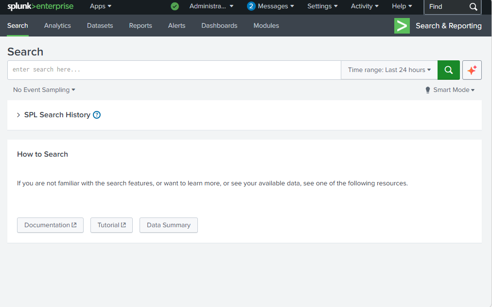
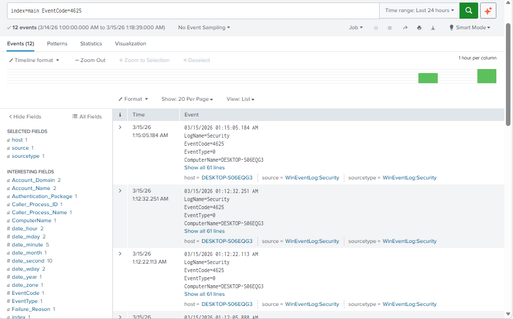
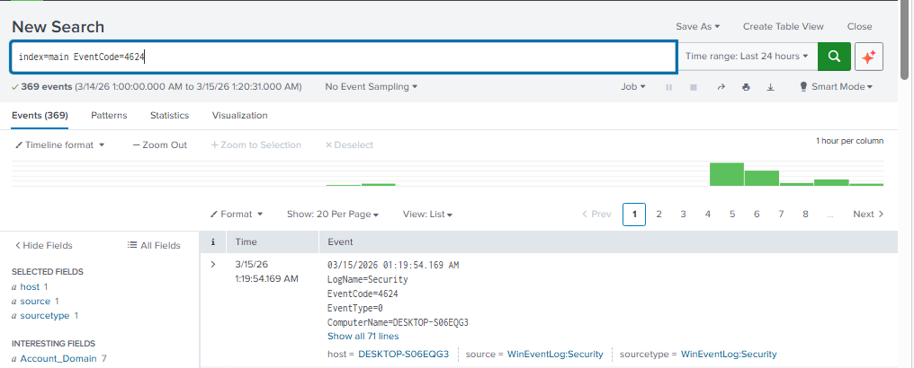
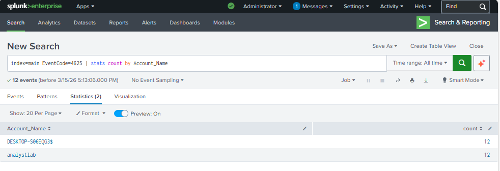
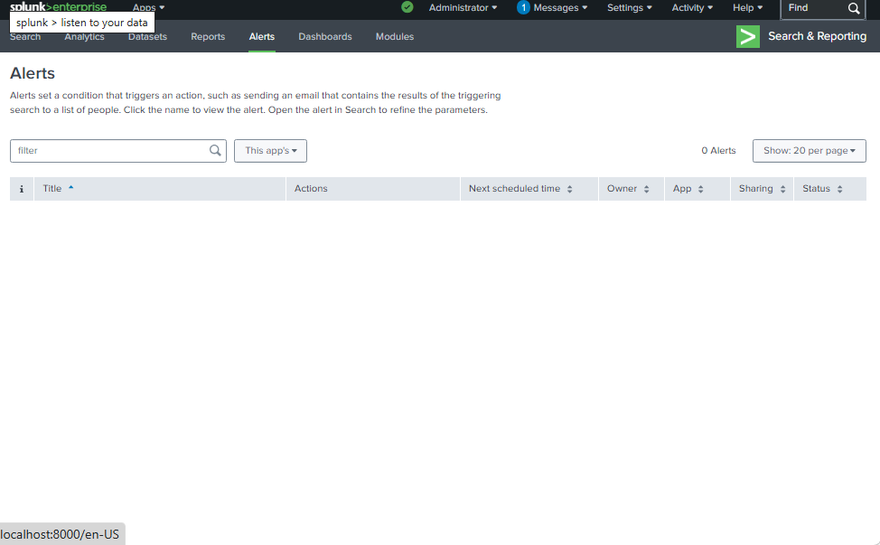
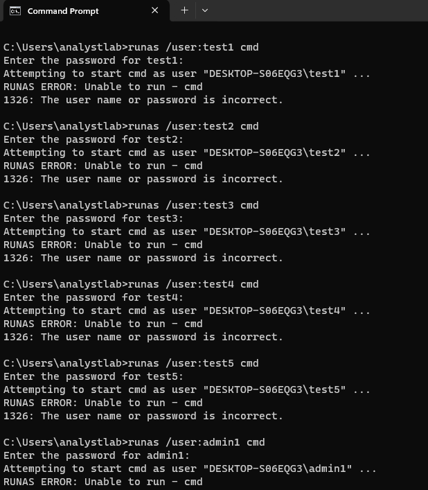
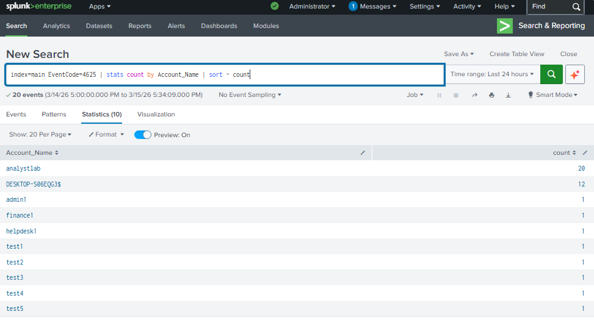
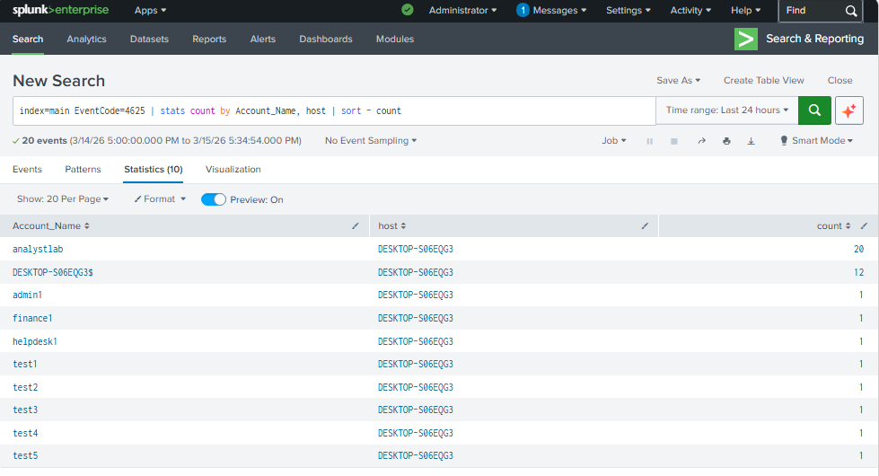
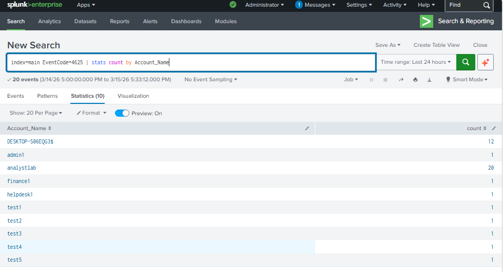

# Windows Authentication Attack Detection with Splunk

Author: Bryan Ortega
Role: Cybersecurity Student | Security Operations | SIEM Monitoring

---

# Overview

This project demonstrates how **Windows authentication attacks can be detected using Splunk SIEM** by monitoring Windows Security Event Logs.

In modern enterprise environments, attackers frequently attempt to gain unauthorized access by abusing authentication mechanisms. Two common attack techniques include:

• **Brute-force login attempts**
• **Password spraying attacks**

Security Operations Center (SOC) analysts use SIEM platforms like **Splunk** to ingest logs, analyze authentication activity, and detect suspicious login behavior.

In this lab, a **Windows virtual machine was configured to send Windows Security logs to Splunk Enterprise**, allowing authentication events to be monitored and analyzed in real time.

Two authentication attack simulations were performed:

1. **Manual brute-force login attempts** using the Windows lock screen.
2. **Password spray attack simulation** using the `runas` command in Command Prompt.

The collected logs were then analyzed in Splunk using **SPL (Search Processing Language)** queries to identify suspicious login patterns.

---

# Lab Environment

| Component             | Description                 |
| --------------------- | --------------------------- |
| SIEM                  | Splunk Enterprise           |
| Log Source            | Windows Security Event Logs |
| Virtualization        | Windows Virtual Machine     |
| Log Type              | WinEventLog:Security        |
| Authentication Events | Event IDs 4624 and 4625     |

---

# Windows Authentication Event IDs

Windows authentication activity generates specific security events that can be monitored by security analysts.

| Event ID | Description          |
| -------- | -------------------- |
| **4624** | Successful logon     |
| **4625** | Failed logon attempt |

Monitoring these events allows analysts to detect suspicious authentication patterns.

---

# Splunk Search Interface

The Splunk Search & Reporting dashboard was used to analyze authentication activity collected from the Windows system.



---

# Detecting Failed Login Attempts

Failed authentication attempts were identified using the following SPL query:

```
index=main EventCode=4625
```

This query searches the Splunk index for Windows Security logs representing failed login attempts.



---

# Detecting Successful Login Activity

Successful authentication events were analyzed using:

```
index=main EventCode=4624
```

These logs confirm when authentication attempts were successful.



---

# Analyzing Failed Logins by Account

To determine which accounts were experiencing repeated login failures, the following statistical query was used:

```
index=main EventCode=4625 | stats count by Account_Name
```

This query groups failed login attempts by account name.

Security analysts often use this method to identify **accounts being targeted by attackers**.



---

# Authentication Alerts Before Attack Simulation

Before performing the password spray simulation, the system was checked for existing alerts or suspicious activity.

No authentication alerts were present at this stage.



---

# Attack Simulation 1 — Manual Brute Force Attempts

The first attack simulation involved manually generating failed login attempts through the Windows lock screen.

### Method

The workstation was locked using:

Windows + L

Multiple incorrect passwords were then entered for the user account.

Each incorrect attempt generated a **Windows Security Event ID 4625**.

These events were ingested by Splunk and indexed for analysis.

This activity simulates a **basic brute-force attack**, where an attacker repeatedly attempts to guess a password for a single account.

---

# Attack Simulation 2 — Password Spray Attack

A **password spray attack** was simulated to demonstrate a more advanced authentication attack technique.

Unlike brute-force attacks that repeatedly target one account, password spraying attempts **a single password across many accounts**.

This technique allows attackers to avoid account lockouts while testing multiple usernames.

---

## Password Spray Simulation

The Windows `runas` command was used to simulate authentication attempts against multiple usernames.

Example command:

```
runas /user:test1 cmd
```

When prompted, the same password was used across multiple usernames.

Commands executed included:

```
runas /user:test1 cmd
runas /user:test2 cmd
runas /user:test3 cmd
runas /user:test4 cmd
runas /user:test5 cmd
runas /user:admin1 cmd
runas /user:helpdesk1 cmd
runas /user:finance1 cmd
```

Each failed authentication generated **Event ID 4625** which Splunk collected and indexed.



---

# Detecting Password Spray Activity

After generating authentication failures across multiple accounts, the following query was used to identify targeted usernames.

```
index=main EventCode=4625 | stats count by Account_Name | sort -count
```

This query sorts failed login attempts by frequency, making it easier to identify accounts targeted during the attack.



---

# Advanced Authentication Analysis

To further analyze authentication failures across both accounts and hosts, the following query was used:

```
index=main EventCode=4625
| stats count by Account_Name, host
| sort -count
```

This query allows analysts to identify:

• targeted accounts
• systems generating authentication attempts
• frequency of attack attempts



---

# Multiple Accounts Targeted During Password Spray

After the password spray simulation, failed authentication attempts were observed across several usernames.



---

# Key Findings

Analysis of the Windows Security logs revealed the following:

### Brute Force Simulation

• Multiple failed login attempts were detected for a single account
• Event ID **4625** appeared for each incorrect password attempt
• Splunk successfully ingested the authentication events

### Password Spray Simulation

• Multiple accounts experienced failed login attempts
• Statistical queries identified targeted usernames
• Sorting results highlighted accounts with the highest failure rates

### Detection Value

Using Splunk, authentication monitoring can detect:

• brute-force login attempts
• password spraying attacks
• repeated authentication failures
• targeted user accounts

These techniques are commonly used by **Security Operations Center (SOC) analysts** when investigating suspicious login activity.

---

# Project Structure

```
splunk-authentication-detection
│
├── README.md
│
├── screenshots
│   ├── 01-splunk-search.png
│   ├── 02-4625-events.png
│   ├── 03-4624-events.png
│   ├── 04-4625-stats-count-by-account.png
│   ├── 05-no-alerts-before-attack.png
│   ├── 06-password-spray-different-accounts.png
│   ├── 07-password-spray-stats-sorted.png
│   ├── 08-password-spray-host-analysis.png
│   └── 09-password-spray-command.png
│
├── evidence
│   └── evidence-summary.md
│
├── findings
│   └── authentication-analysis.md
│
└── queries
    └── splunk-detection-queries.md
```

---

# Skills Demonstrated

This project demonstrates practical experience in:

• SIEM configuration and log ingestion
• Windows Security Event log monitoring
• Authentication attack detection
• Splunk SPL query analysis
• Security investigation techniques

These skills are directly relevant to **SOC Analyst**, **Security Analyst**, and **Threat Detection** roles.

---

# Future Improvements

Future enhancements to this lab could include:

• brute force threshold alerting
• suspicious login time detection
• PowerShell attack detection
• privilege escalation monitoring
• automated Splunk alert rules
